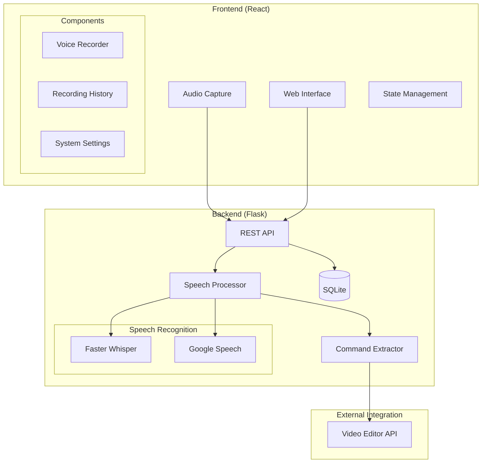

# AdobeVoice 🎙️

Voice3Frame - это интеллектуальная система голосового управления для видеомонтажа, предоставляющая API для распознавания и интерпретации голосовых команд. Система включает веб-интерфейс для тестирования и настройки, а также API для интеграции с видеоредакторами.

## 🌟 Основные возможности

- Мультимодальное распознавание речи (Google Speech Recognition / Whisper)
- Локальная обработка аудио через Faster Whisper
- Анализ аудио и текстовых модальностей
- Классификация и извлечение команд для видеомонтажа
- REST API для интеграции с внешними приложениями
- Мониторинг системных ресурсов
- История записей с возможностью воспроизведения

## 🏗️ Архитектура системы



## 🔄 Процесс обработки команд

1. **Захват аудио**
   - Запись через Web Audio API
   - Конвертация в WAV формат
   - Отправка на сервер

2. **Распознавание речи**
   - Выбор модели распознавания (Whisper/Google)
   - Преобразование аудио в текст
   - Сохранение результатов

3. **Анализ команд**
   - Извлечение команд из текста
   - Классификация действий
   - Формирование API-запросов

4. **Интеграция**
   - Передача команд видеоредактору
   - Получение обратной связи
   - Логирование результатов

## 📁 Структура проекта

```
voice3frame/
├── client/                 # Frontend (React)
│   ├── src/
│   │   ├── components/    # React компоненты
│   │   ├── store/        # Zustand хранилища
│   │   └── styles/       # CSS стили
│   └── public/           # Статические файлы
└── server/               # Backend (Python/Flask)
    ├── app.py           # Основной сервер
    ├── speech_processor.py  # Обработка речи
    └── records/         # Директория записей
```

## 🛠️ Технологии

### Frontend
- React 18
- Zustand (управление состоянием)
- Web Audio API
- CSS Modules
- FontAwesome

### Backend
- Flask
- SQLite
- Faster Whisper
- Google Speech Recognition
- Python 3.10+

## 🚀 Запуск проекта

1. **Настройка окружения**
```bash
# Клонирование репозитория
git clone https://github.com/yourusername/voice3frame.git
cd voice3frame
```

2. **Запуск сервера**
```bash
cd server
python -m venv venv
source venv/bin/activate  # или venv\Scripts\activate на Windows
pip install -r requirements.txt
python app.py
```

3. **Запуск клиента**
```bash
cd client
npm install
npm start
```

## 🔌 API Endpoints

### Распознавание речи
- `POST /api/process-audio` - Обработка аудиофайла
- `GET /api/recordings` - Получение истории записей
- `DELETE /api/recordings/{id}` - Удаление записи

### Управление моделями
- `POST /api/initialize-models` - Инициализация моделей
- `GET /api/models-info` - Информация о моделях
- `POST /api/clear-models` - Очистка кэша моделей

### Системные
- `GET /api/memory-usage` - Использование памяти
- `GET /api/health-check` - Проверка работоспособности

## 📊 Мониторинг

Система включает встроенные инструменты мониторинга:
- Использование памяти
- Статус моделей распознавания
- Логирование операций
- Статистика распознавания

